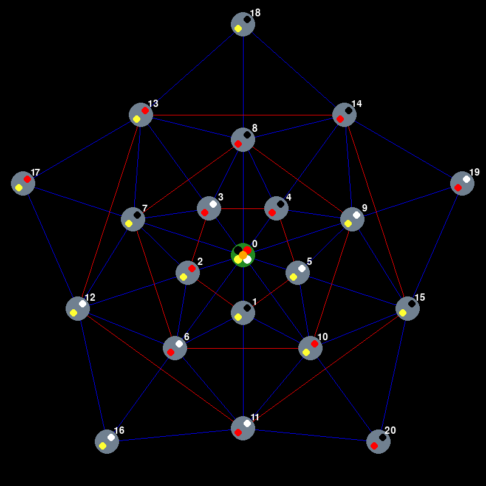

# Game rules

The game, named *Iris*, is a two-player zero-sum game with perfect information. It is set on a board represented by a **graph** structure, composed of **21 nodes**. This graph comprises a **single central node** and **four surrounding pentagons**. The edges are shown in the figure below (colors of the edges are not relevant). The game features **five distinct pawns**: yellow and red, which represent the players, and black, white and orange, which are neutral.

The objective of *Iris* is for each player to maneuver their respective pawn from the central node to the outermost pentagon before the other player to win.

<table>
  <tr>
    <td valign="top" width="50%">
      
      

        <em>Figure: Iris initial position board</em>
      

    </td>
    <td valign="top" width="50%">
      The game involves <b>20 tiles</b>, each assigned to
      nodes 1 through 20. These tiles are <b>dualcolored</b>: yellow-red, yellow-black, yellow-white, red-black, and red-white. These tiles are distributed randomly across the nodes, with the one rule that each pentagon must contain one tile of each type.   
      At the start of the game, every pawn is placed on the central node. <b>The yellow player is the first to play</b>.
    </td>
  </tr>
</table> 

## Player Actions

On his turn, a player can perform one of the following actions:

- **Remove a tile:** A player can remove a tile that is adjacent to his player's pawn. This action is possible if the pawns, whose colors correspond to the colors on the tile, are also adjacent to this tile (the orange pawn is yellow and red). After removing the tile, the player's pawn moves to the now uncovered node.

- **Move the player's pawn:** The player's pawn can be moved to an adjacent uncovered node, as long as another pawn does not occupy it. The exception to this rule is the central node, which can host multiple pawns simultaneously.

- **Remove a tile with the orange pawn:** A player can remove a tile that is adjacent to the orange pawn. This action is possible if the pawns, whose colors correspond to the colors on the tile, are also adjacent to this tile (the orange pawn is yellow and red). After removing the tile, the orange pawn moves to the now uncovered node.

- **Move a neutral pawn:** A neutral pawn (black, white or orange) can be moved to an adjacent uncovered node under the same conditions as the player's pawn, except it is not allowed to move to the central node. 

If a neutral pawn (black, white or orange) is used, it cannot be used by the other player in the next turn. To balance this, a single player cannot use the same neutral pawn more than twice in a row.

If none of the above actions are possible, the player's pawn returns to the central node and the player skips his turn.
